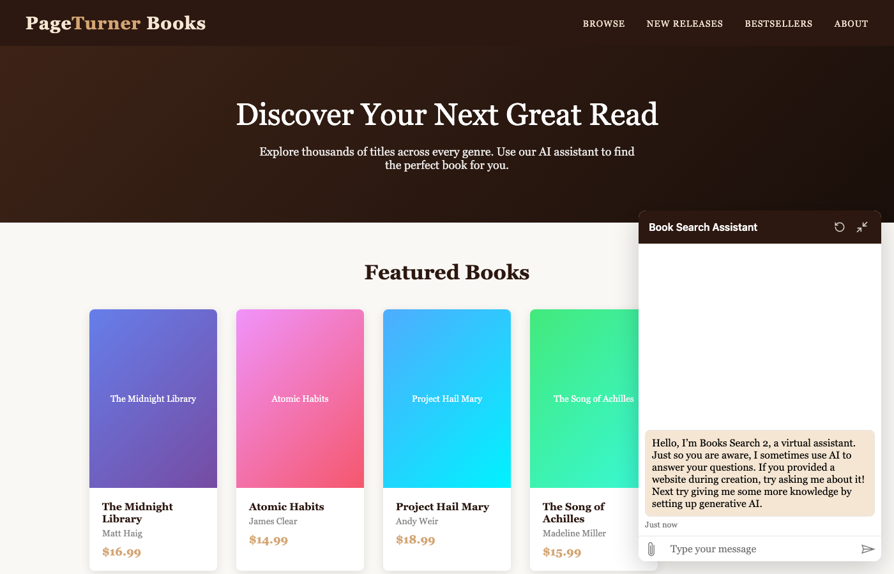

# botframework-webchat-embed

Embed BotFramework WebChat into any HTML page using data attributes. No JavaScript knowledge required.



## Quick Start

```html
<!-- 1. Add a container with your token endpoint URL -->
<div
  style="width: 400px; height: 600px;"
  data-webchat-token-url="https://your-server.com/api/directline/token">
</div>

<!-- 2. Load the script -->
<script src="https://cdn.jsdelivr.net/npm/botframework-webchat-embed@latest"></script>
```

That's it! The script automatically finds elements with `data-webchat-token-url` and renders a chat widget.

## Features

- **Zero JavaScript required** - Configure everything via HTML data attributes
- **Floating chat bubble** - Starts minimized with a customizable button
- **Auto-inherits styles** - Picks up your site's CSS variables and fonts
- **Restart conversation** - Built-in button to start fresh
- **Fully customizable** - Control colors, fonts, and WebChat styleOptions

## Getting Your Token Endpoint (Copilot Studio)

1. In the navigation menu under **Settings**, select **Channels**
2. Select **Email** - the configuration panel appears
3. Next to **Token Endpoint**, select **Copy**

Use this URL as the `data-webchat-token-url` value.

## Limitations

This library currently only supports **Copilot Studio agents with no authentication**. It does not support:

- Direct Line secrets
- Authenticated agents (Entra ID, etc.)

For agents requiring authentication, use the [BotFramework WebChat SDK](https://github.com/microsoft/BotFramework-WebChat) directly.

## Supported Attributes

### Required

| Attribute | Description |
|-----------|-------------|
| `data-webchat-token-url` | URL to fetch Direct Line token |

### Widget Behavior

| Attribute | Default | Description |
|-----------|---------|-------------|
| `data-webchat-title` | `"Chat"` | Header title text |
| `data-webchat-bubble-text` | *(icon only)* | Text on the floating bubble button |
| `data-webchat-minimized` | `true` | Start minimized (show bubble) |
| `data-webchat-preload` | `false` | Load conversation on page load (even if minimized) |
| `data-webchat-send-start-event` | `true` | Send `startConversation` event to trigger welcome message |
| `data-webchat-mock-welcome` | *(none)* | Show a client-side mock welcome message instead of calling the agent |
| `data-webchat-domain` | *(default)* | Custom Direct Line domain URL (e.g., for regional endpoints or Azure Government) |

### User Identity

| Attribute | Description |
|-----------|-------------|
| `data-webchat-user-id` | User ID for conversation |
| `data-webchat-username` | Display name for user |
| `data-webchat-locale` | Language locale (e.g., `en-US`) |

### Styling

| Attribute | Description |
|-----------|-------------|
| `data-webchat-header-background` | Header/bubble background color |
| `data-webchat-header-color` | Header/bubble text color |
| `data-webchat-style-options` | Reference to global styleOptions object |
| `data-webchat-style-*` | Any WebChat styleOption (kebab-case) |

## Style Inheritance

The widget automatically inherits styles from your page:

### CSS Variables (auto-detected)

```css
:root {
  --primary-color: #0078d4;  /* Used for header/accent */
  --border-radius: 12px;     /* Used for bubble roundness */
}
```

Checked variable names (in order): `--primary-color`, `--accent-color`, `--brand-color`, `--color-primary`, `--theme-primary`

### Font Inheritance

The widget inherits `font-family` from its container element automatically.

### styleOptions Object

For advanced styling, reference a global object:

```html
<script>
  window.myStyles = {
    bubbleBackground: '#f0f0f0',
    bubbleFromUserBackground: '#0078d4',
    bubbleFromUserTextColor: '#ffffff',
    accent: '#0078d4'
  };
</script>
<div data-webchat-style-options="myStyles" ...></div>
```

### Individual Style Attributes

Override specific styles with `data-webchat-style-*` attributes:

```html
<div
  data-webchat-style-accent-color="#ff0000"
  data-webchat-style-bubble-border-radius="8"
  data-webchat-style-hide-upload-button="true"
  ...>
</div>
```

See [WebChat styleOptions](https://github.com/microsoft/BotFramework-WebChat/blob/main/packages/api/src/StyleOptions.ts) for all available options.

## Style Priority

1. **Auto-detected** (CSS variables, computed font) - lowest
2. **`data-webchat-style-options`** object - overrides auto-detected
3. **`data-webchat-style-*`** attributes - highest priority

## Mock Welcome Message

By default, the widget sends a `startConversation` event to trigger the agent's welcome message. This counts as a message in your usage metrics.

To show a client-side mock welcome message instead (no agent call), use `data-webchat-mock-welcome`:

```html
<!-- Default mock message -->
<div
  data-webchat-token-url="..."
  data-webchat-mock-welcome>
</div>

<!-- Custom mock message -->
<div
  data-webchat-token-url="..."
  data-webchat-mock-welcome="Hi! How can I help you today?">
</div>
```

When enabled:
- A fake welcome message is injected client-side when the chat opens
- The `startConversation` event is **not** sent (even if `data-webchat-send-start-event="true"`)
- No agent message consumption occurs until the user actually sends a message

This is useful for reducing costs when many visitors open the chat but don't engage.

## Container Sizing

You control the widget size via CSS on the container element:

```html
<!-- Fixed position chat widget -->
<style>
  .chat-widget {
    position: fixed;
    bottom: 20px;
    right: 20px;
    width: 380px;
    height: 550px;
  }
</style>
<div class="chat-widget" data-webchat-token-url="..."></div>
```

## CDN Links

```html
<!-- jsDelivr (recommended) -->
<script src="https://cdn.jsdelivr.net/npm/botframework-webchat-embed@latest"></script>

<!-- unpkg -->
<script src="https://unpkg.com/botframework-webchat-embed"></script>

<!-- Specific version -->
<script src="https://cdn.jsdelivr.net/npm/botframework-webchat-embed@1.0.1"></script>
```

## License

MIT License - See [LICENSE](LICENSE) file.

## Contributing

Contributions are welcome! Please open an issue or submit a pull request.

## Disclaimer

This project is provided as-is with no warranty. Use at your own risk.
